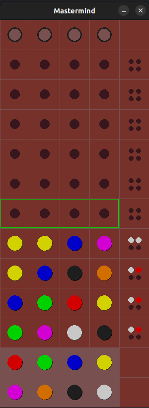

# Mastermind game in Python with pygame

Mastermind in Python, with Pygame library, and Object-Oriented Programming.

To install and run =>

- Linux
sudo apt-get install python3-pygame

And after
python3 -m pip install -U pygame --user

- Windows
py -m pip install -U pygame --user

For run it
python3 main.py

## Screen capture game

